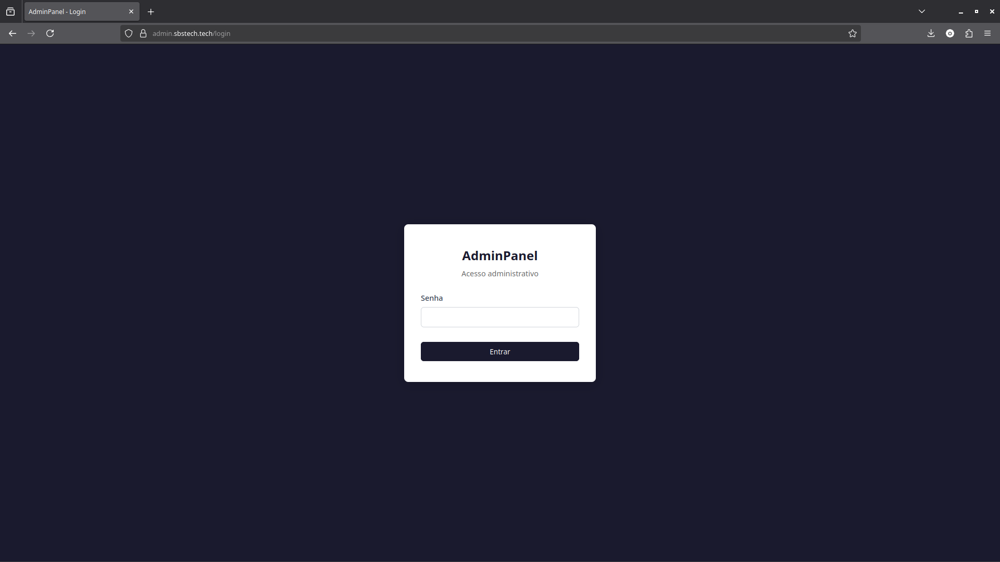
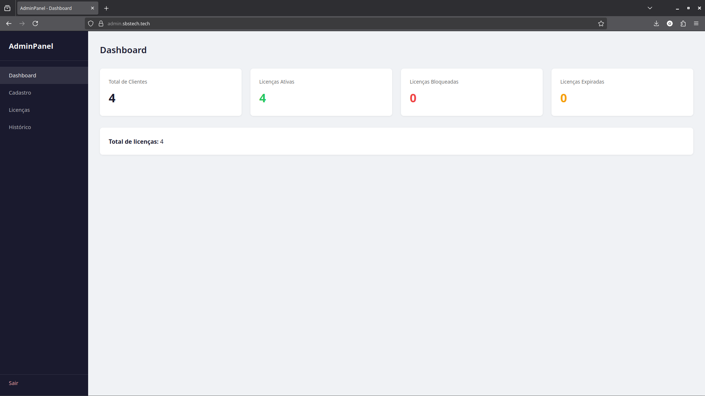
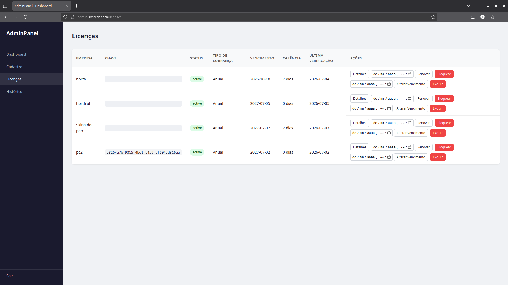
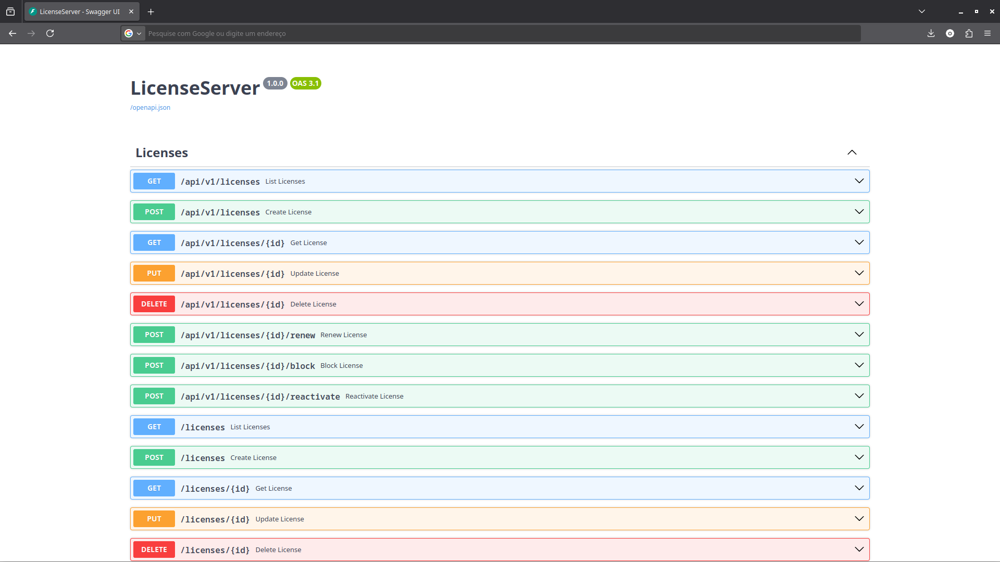
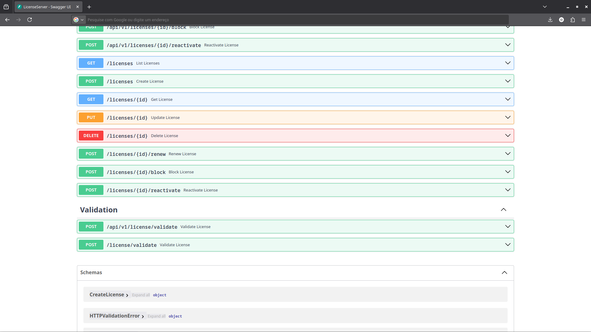

# 🔐 SBS License System

Sistema de gerenciamento de licenças desenvolvido para controlar o acesso aos sistemas comerciais da SBS Tech.

## 🚀 Funcionalidades

- Validação de licenças
- Cadastro de clientes
- Bloqueio de licenças
- Renovação
- Reativação
- Dashboard administrativo
- API REST
- Controle centralizado
- Hospedagem em VPS Linux
- HTTPS com domínio próprio

## 🛠 Tecnologias

- Python
- FastAPI
- PostgreSQL
- SQLAlchemy
- JWT
- Uvicorn
- Nginx
- Linux
- GitHub Actions

## 🏗 Arquitetura

Sistema Desktop

↓

License Server (FastAPI)

↓

PostgreSQL

↓

Admin Panel

## 📷 Admin Panel

### Login

### Dashboard

### Licenças

## 📷 API

### Swagger

### Validação de Licença

## 💡 Objetivo

Este projeto foi desenvolvido para controlar o licenciamento dos sistemas comerciais da SBS Tech de forma centralizada, permitindo gerenciar clientes e validar licenças em tempo real através de uma API hospedada em VPS.

## 👨‍💻 Autor

Samuel Barbosa da Silva

SBS Tech
